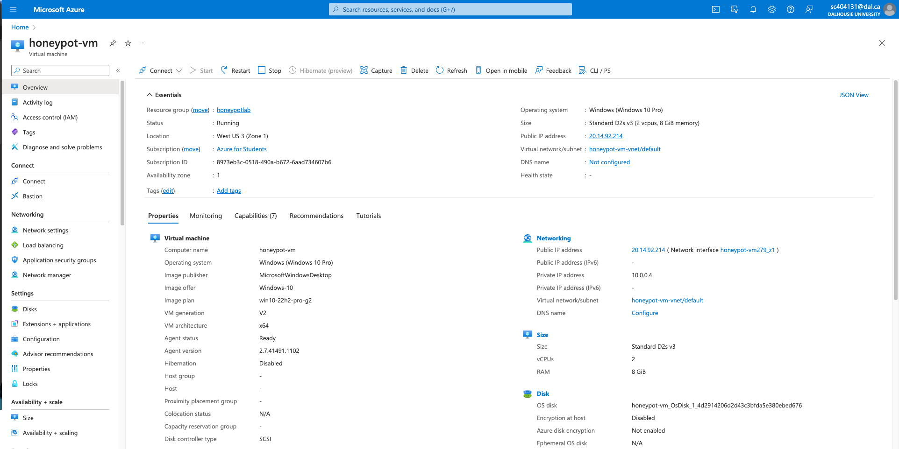
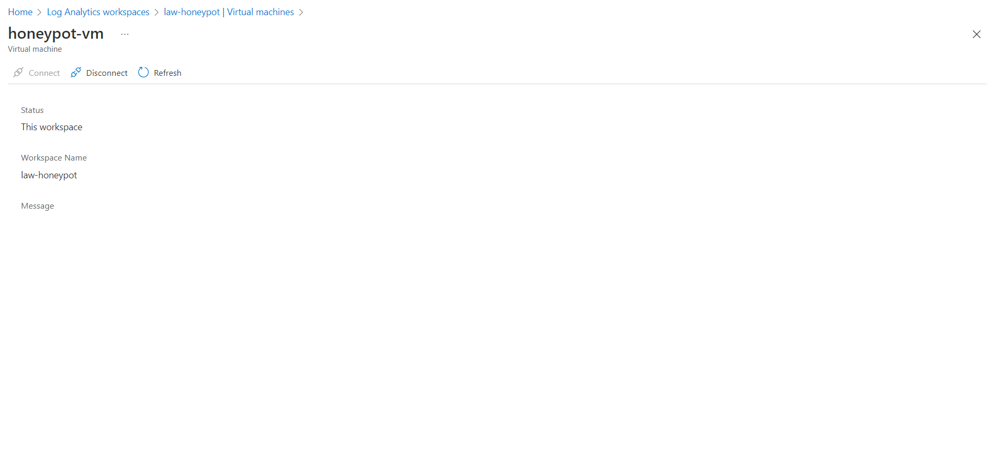
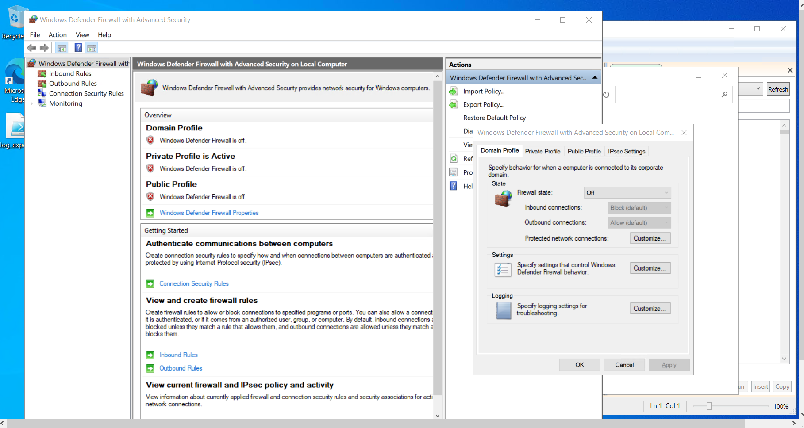

<h1>Microsoft Azure: Azure Sentinel (SIEM & SOAR) Project</h1>

<h2>Description</h2>
In this lab, I implemented Azure Sentinel as a SIEM & SOAR solution, integrated with a live honeypot VM. This allowed for monitoring of global RDP Brute Force attacks. I employed a custom PowerShell script to extract attacker geolocation data and plotted it on the Azure Sentinel Map for enhanced visual insights.
<br />


<h2>Languages and Utilities Used</h2>

- <b>PowerShell</b> 
- <b>Microsoft Azure</b>
- <b>Remote Desktop Connection</b>

<h2>Environments Used </h2>

- <b>Windows 10</b> (21H2)

<h2>Program walk-through:</h2>

<p align="center">
Create a VM that is discoverable to all traffic: <br/>

<br />
<br />
Change security group inbound rules to make the VM very discoverable:  <br/>

<br />
<br />
Create a Log Analytics Workspace to log the inbound traffic to the VM: <br/>

<br />
<br />
Connect the Log Analytics Workspace to the VM:  <br/>

<br />
<br />
Run the VM and connect to it via Remote Desktop Connection:  <br/>

<br />
<br />
Turn off Windows Firewall within the RDC VM:  <br/>

<br />
<br />
Test ping from personal computer to VM:  <br/>

<br />
<br />
Get an API Key if you dont already have one (ipgeolocation.io):  <br/>

<br />
<br />
Run custom script with your API Key on Windows PowerShell ISE to get Geo Data from attackers :  <br/>

<br />
<br />
Save script as log file and it'll create a txt file with all the failed login attempts Geo Data :  <br/>

<br />
<br />
Create a custom log thats linked to the txt file with all the failed login attempts Geo Data:  <br/>

<br />
<br />
Using the SQL Query in logs, observe the data security audit logs:  <br/>

<br />
<br />
Using the SQL Query in logs, observe the data from the custom log:  <br/>

<br />
<br />
Extract the fields from raw custom logs:  <br/>

<br />
<br />
Check custom fields to confirm before testing:  <br/>

<br />
<br />
Test new custom fields which were extracted to see if they collect the data:  <br/>

<br />
<br />
Create Microsoft Sentinel:  <br/>

<br />
<br />
Within Microsoft Sentinel, setup a map in workbooks using longitude and latitude:  <br/>

<br />
<br />
Use the following SQL Query to isolate which data to be shown, and the following map settings to display on world map:  <br/>


<br />
<br />
After a couple hours the VM will be found by the cyber attackers of the world. Now you can observe Geo Data from where your VM is being breached!:  <br/>

<br />
<br />
This Concludes This Microsoft Azure SIEM Project!
NOTE: You can toggle map setting to display other custom fields  <br/>
<br />
</p>

<!--
 ```diff
- text in red
+ text in green
! text in orange
# text in gray
@@ text in purple (and bold)@@
```
--!>
